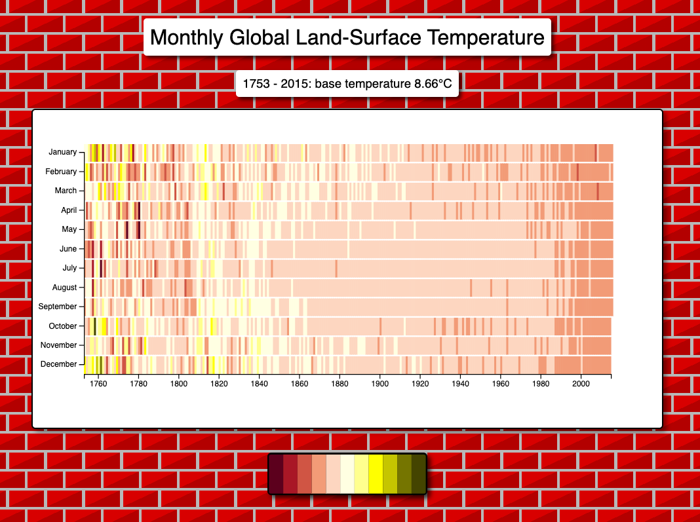

# visualize-data-heat-map

 

</a>

 

## Summary

This is a basic project from the "Data Visualization" FreeCodeCamp course. It allows you to see the variance on the temperature of earth between years on a heat map.

Each color represents a different temperature. You can hover over each bar to see more information.
